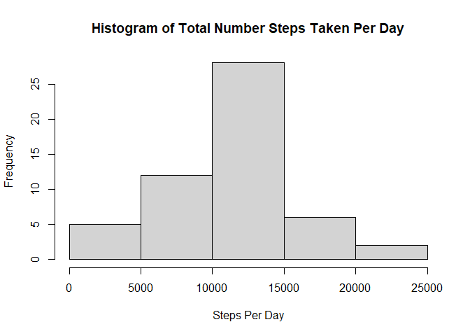
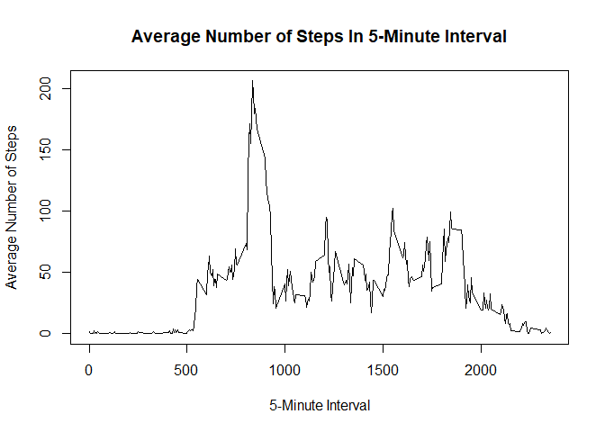
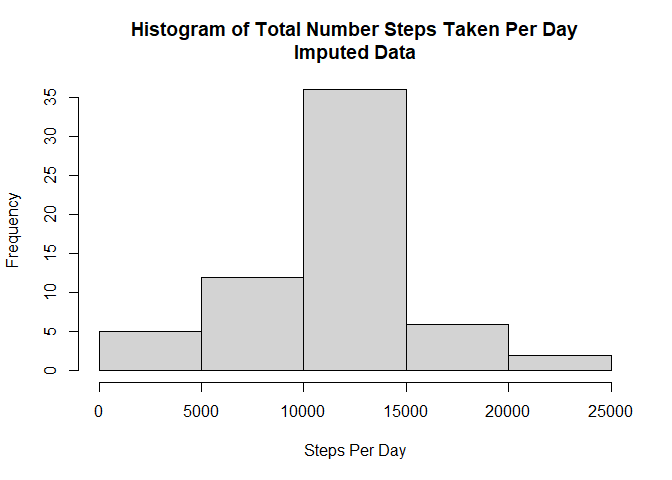
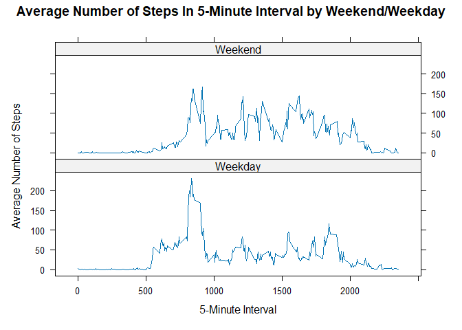

### Loading and Preprocessing the Data

First we load the data...


```r
################################################################################
# getZipFile(): Function to download zip file and extract contents
################################################################################
getZipFile <- function(url) {
    
    # Create sub-dir "data" in current dir if it doesn't exist
    if(!file.exists("./data")){dir.create("./data")} 
    
    ### Download Data
    fileUrl <- url
    
    # Generate file name 
    destfilename <- 'Dataset';destfiletype <- 'zip'
    fileName <- paste("./data/",destfilename,".",destfiletype,sep="") 

    # Download zip file    
    download.file(fileUrl,destfile=fileName) 
    
    ### Unzip to /data directory
    unzip(zipfile=fileName,exdir="./data")
    
    ### Delete any unnecessary files
    file.remove(fileName) 
}
################################################################################

# Call getZipFile() to download and extract activity data
# Should return TRUE
getZipFile('https://d396qusza40orc.cloudfront.net/repdata%2Fdata%2Factivity.zip')
```

```
## [1] TRUE
```

```r
# Read activity data into R
act <- read.csv("./data/activity.csv")
```

Next, we process/transform the data. The only processing here is to transform the "date" variable into a date-class object.


```r
# Make date a date-class variable
act <- act %>% mutate(date = as.Date(date,"%Y-%m-%d"))
```

### What is the Mean Total Number of Steps Taken Per Day?


```r
# Calculate total number of steps taken per day
steps <- act %>% 
    filter(!is.na(steps)) %>% # delete obs with missing values for steps
    group_by(date) %>%
    summarize(
        stepsperday = sum(steps,na.rm = T)
    )

# Histogram
hist(steps$stepsperday, main='Histogram of Total Number Steps Taken Per Day',xlab='Steps Per Day')
```

<!-- -->

The mean number of steps taken per day is 10766.2 and the median number of steps taken per day is 10765.

### What is the Average Daily Activity Pattern?


```r
# Calculate avg steps in interval over all dates
int5 <- act %>% filter(!is.na(steps)) %>% # delete obs with missing values for steps
    group_by(interval) %>%
    summarize(
        avgSteps = mean(steps,na.rm=T)
    )

# Plot average daily activity pattern (avg # steps in each interval across all dates)
plot(int5$interval,int5$avgSteps,type = 'l',xlab='5-Minute Interval',ylab='Average Number of Steps',
     main = "Average Number of Steps In 5-Minute Interval")
```

<!-- -->

Interval 835 is the 5-minute interval that contains the maximum number of average steps.

### Imputing Missing Values

Missing step values will be imputed with mean number of steps for the given 5-minute interval (averaged across all dates).


```r
# All obs with NO missing values
nomiss <- act %>% filter(!is.na(steps))

# All obs with missing values
miss <- act %>% filter(is.na(steps))

### Impute missing with average steps in interval across all dates (int5$avgSteps)
missImpute <- merge(miss,int5,by='interval',all.x=T)

missImpute <- missImpute %>% 
    mutate(steps = avgSteps) %>%   # impute with avgSteps 
    select(c(steps,date,interval)) # grab what you need

# Create new dataset equal to original but with imputed values
actImpute <- rbind(missImpute,nomiss) 
actImpute <- actImpute %>% arrange(date,interval) # order by date then interval

# Calculate total number of steps taken per day with imputed data
steps <- actImpute %>% 
    group_by(date) %>%
    summarize(
        stepsperday = sum(steps,na.rm = T)
    )

# Histogram
hist(steps$stepsperday, main='Histogram of Total Number Steps Taken Per Day\nImputed Data',xlab='Steps Per Day')
```

<!-- -->

In total, there are 2304 observations with missing values.

For the imputed data, the mean number of steps taken per day is 10766.2 and the median number of steps taken per day is 10766.2. These values are virtually identical to those obtained by simply deleting missing observations. The impact of imputation on mean and median calculations is negligible.

### Are There Differences in Activity Patterns Between Weekdays and Weekends?

For this question we'll use the dataset with imputed values.

```r
# Get weekday/weekend
actImpute <- actImpute %>% 
    mutate(
        daytype = case_when(
            weekdays(date) %in% c('Saturday','Sunday') ~ "Weekend",
            weekdays(date) %in% c('Monday','Tuesday','Wednesday','Thursday','Friday') ~ "Weekday"
            )
    )

actImpute$daytype <- as.factor(actImpute$daytype) # make factor

# Calculate avg steps in interval over all weekdays and weekends, respectively
int5 <- actImpute %>% 
    group_by(daytype,interval) %>%
    summarize(
        avgSteps = mean(steps,na.rm=T), .groups = "drop"
    )

# Panel Plot
xyplot(avgSteps ~ interval | daytype, data = int5, layout = c(1,2),type='l',
       xlab='5-Minute Interval',
       ylab='Average Number of Steps',
       main='Average Number of Steps In 5-Minute Interval by Weekend/Weekday')
```

<!-- -->

Looks like average number of steps tends to be higher on weekends
